# Fact Check Agent - Technical Implementation

## Overview

The Fact Check Agent is a sophisticated AI-powered system designed to automatically identify, analyze, and verify claims made in social media posts and their comments. Built on the PydanticAI framework, it integrates seamlessly with the FFP project to provide real-time fact-checking capabilities for content flowing through the Telegram-to-X bridge.

## System Architecture Flow

```mermaid
graph TB
    %% Input Sources
    TG[📱 Telegram Channels] --> TM[Telegram Monitor]
    SM[🌐 Social Media Posts] --> API[REST API Endpoint]
    COM[💬 Comments Thread] --> API

    %% Main Processing Pipeline
    TM --> MQ[Message Queue]
    API --> MQ
    MQ --> FC[🤖 Fact Check Agent]

    %% Core Components
    FC --> CE[🔍 Claim Extractor]
    CE --> NLP[🧠 NLP Pipeline]
    NLP --> |Extract Claims| CLAIMS[📝 Claims List]

    %% Verification Engine
    CLAIMS --> VE[⚖️ Verification Engine]

    %% Knowledge Base Check
    VE --> KB[🗄️ Knowledge Base]
    KB --> |Cache Hit| VERDICT[✅ Cached Verdict]
    KB --> |Cache Miss| SEARCH[🔍 Multi-Source Search]

    %% External Sources
    SEARCH --> WS[🌐 Web Search API]
    SEARCH --> FC_SITES[🔬 Fact-Check Sites]
    SEARCH --> NEWS[📰 News Sources]
    SEARCH --> GOV[🏛️ Government Data]

    %% Evidence Collection
    WS --> EV[📊 Evidence Collector]
    FC_SITES --> EV
    NEWS --> EV
    GOV --> EV

    %% AI Analysis
    EV --> AI[🤖 AI Analyzer]
    AI --> |Generate Verdict| VERDICT

    %% Confidence Scoring
    VERDICT --> CS[📈 Confidence Scorer]
    CS --> |High/Medium| STORE[💾 Store Result]
    CS --> |Low| FLAG[🚩 Flag for Review]

    %% Output Processing
    STORE --> DB[(🗃️ SQLite Database)]
    VERDICT --> MP[📤 Message Processor]
    FLAG --> HR[👤 Human Review]

    %% Final Output
    MP --> |Add Disclaimer| TWITTER[🐦 X/Twitter]
    MP --> |Original Message| TWITTER
    HR --> |Reviewed| STORE

    %% Styling
    classDef input fill:#e1f5fe
    classDef processing fill:#f3e5f5
    classDef external fill:#fff3e0
    classDef storage fill:#e8f5e8
    classDef output fill:#fce4ec

    class TG,SM,COM input
    class FC,CE,NLP,VE,AI,CS,MP processing
    class WS,FC_SITES,NEWS,GOV external
    class KB,DB,STORE storage
    class TWITTER,HR output
```



## Detailed Data Flow


## Component Interaction Diagram


## Core Architecture

### 1. Agent Framework (PydanticAI)

The agent uses PydanticAI for structured AI interactions with strict type safety and validation:

```python
from pydantic_ai import Agent
from pydantic import BaseModel
from typing import List, Optional, Union

class FactCheckAgent(Agent):
    """Main fact-checking agent orchestrating all verification processes."""
    model = "gpt-4-turbo"  # or claude-3-sonnet
    system_prompt = """You are a fact-checking agent that identifies claims
                      in social media posts and verifies them using multiple sources."""
```

### 2. Data Models

#### Core Pydantic Models

```python
from enum import Enum
from datetime import datetime
from pydantic import BaseModel, Field, validator

class ClaimType(str, Enum):
    STATISTICAL = "statistical"
    HISTORICAL = "historical"
    SCIENTIFIC = "scientific"
    QUOTE = "quote"
    EVENT = "event"
    POLICY = "policy"

class ConfidenceLevel(str, Enum):
    HIGH = "high"        # 80-100%
    MEDIUM = "medium"    # 60-79%
    LOW = "low"         # 40-59%
    INSUFFICIENT = "insufficient"  # <40%

class Claim(BaseModel):
    """Represents a factual claim extracted from social media content."""
    id: str = Field(..., description="Unique identifier")
    text: str = Field(..., min_length=10, description="The actual claim text")
    claim_type: ClaimType
    confidence: float = Field(..., ge=0.0, le=1.0)
    context: str = Field(..., description="Surrounding context from the post")
    extracted_entities: List[str] = Field(default_factory=list)
    keywords: List[str] = Field(default_factory=list)

class EvidenceSource(BaseModel):
    """Represents a source of evidence for claim verification."""
    url: str
    title: str
    domain: str
    credibility_score: float = Field(..., ge=0.0, le=1.0)
    bias_rating: Optional[str] = None  # left, center, right
    publication_date: Optional[datetime] = None
    relevant_excerpt: str
    source_type: str  # "fact_checker", "news", "academic", "government"

class Evidence(BaseModel):
    """Evidence collected for a specific claim."""
    claim_id: str
    sources: List[EvidenceSource]
    supporting_count: int = 0
    contradicting_count: int = 0
    neutral_count: int = 0
    overall_confidence: ConfidenceLevel

class FactCheckVerdict(BaseModel):
    """Final verdict on a claim's truthfulness."""
    claim_id: str
    verdict: str  # "TRUE", "FALSE", "PARTIALLY_TRUE", "UNVERIFIABLE", "MISLEADING"
    confidence: ConfidenceLevel
    explanation: str = Field(..., min_length=50)
    evidence_summary: str
    sources_consulted: List[str]
    verification_timestamp: datetime = Field(default_factory=datetime.utcnow)

class PostAnalysis(BaseModel):
    """Complete analysis of a social media post."""
    post_id: str
    post_url: Optional[str] = None
    post_text: str
    claims: List[Claim]
    verdicts: List[FactCheckVerdict]
    overall_credibility: ConfidenceLevel
    analysis_timestamp: datetime = Field(default_factory=datetime.utcnow)
```

### 3. Claim Extraction Module

The claim extraction system uses advanced NLP techniques to identify factual assertions:

```python
import spacy
from transformers import pipeline
from typing import List, Tuple

class ClaimExtractor:
    """Extracts factual claims from social media posts using NLP."""

    def __init__(self):
        self.nlp = spacy.load("en_core_web_sm")
        self.claim_classifier = pipeline(
            "text-classification",
            model="microsoft/DialoGPT-medium"  # Fine-tuned for claim detection
        )
        self.ner_pipeline = pipeline("ner", aggregation_strategy="simple")

    async def extract_claims(self, text: str) -> List[Claim]:
        """Extract factual claims from input text."""
        doc = self.nlp(text)
        sentences = [sent.text.strip() for sent in doc.sents]

        claims = []
        for sentence in sentences:
            if await self._is_factual_claim(sentence):
                claim = await self._create_claim_object(sentence, text)
                claims.append(claim)

        return claims

    async def _is_factual_claim(self, sentence: str) -> bool:
        """Determine if a sentence contains a factual claim."""
        # Statistical patterns
        if self._contains_statistics(sentence):
            return True

        # Temporal claims
        if self._contains_temporal_markers(sentence):
            return True

        # Causal claims
        if self._contains_causal_language(sentence):
            return True

        # Use ML classifier for complex cases
        result = self.claim_classifier(sentence)
        return result[0]['label'] == 'CLAIM' and result[0]['score'] > 0.7

    def _contains_statistics(self, text: str) -> bool:
        """Check for statistical claims (percentages, numbers, etc.)."""
        import re
        patterns = [
            r'\d+%',  # percentages
            r'\d+(\.\d+)?\s*(million|billion|thousand)',  # large numbers
            r'\d+(\.\d+)?\s*(times|fold)',  # multipliers
            r'(increased|decreased|rose|fell)\s+by\s+\d+',  # changes
        ]
        return any(re.search(pattern, text, re.IGNORECASE) for pattern in patterns)
```

### 4. Verification Tools

#### Web Search Integration

```python
import aiohttp
from typing import List, Dict, Any

class WebSearchTool:
    """Tool for searching the web to find relevant information."""

    def __init__(self, api_key: str):
        self.api_key = api_key
        self.base_url = "https://api.bing.microsoft.com/v7.0/search"

    async def search(self, query: str, num_results: int = 10) -> List[Dict[str, Any]]:
        """Search the web for information about a claim."""
        headers = {"Ocp-Apim-Subscription-Key": self.api_key}
        params = {
            "q": query,
            "count": num_results,
            "mkt": "en-US",
            "freshness": "Month"  # Prefer recent results
        }

        async with aiohttp.ClientSession() as session:
            async with session.get(self.base_url, headers=headers, params=params) as response:
                data = await response.json()
                return data.get("webPages", {}).get("value", [])

class FactCheckingSitesTool:
    """Tool for querying established fact-checking websites."""

    FACT_CHECK_SITES = [
        "snopes.com",
        "factcheck.org",
        "politifact.com",
        "fullfact.org",
        "checkyourfact.com",
        "factcheck.afp.com"
    ]

    async def search_fact_checkers(self, claim: str) -> List[EvidenceSource]:
        """Search fact-checking sites for existing verifications."""
        sources = []

        for site in self.FACT_CHECK_SITES:
            query = f"site:{site} {claim}"
            results = await self.web_search.search(query, num_results=3)

            for result in results:
                source = EvidenceSource(
                    url=result["url"],
                    title=result["name"],
                    domain=site,
                    credibility_score=self._get_site_credibility(site),
                    relevant_excerpt=result.get("snippet", ""),
                    source_type="fact_checker"
                )
                sources.append(source)

        return sources

    def _get_site_credibility(self, domain: str) -> float:
        """Return credibility score for known fact-checking sites."""
        credibility_map = {
            "snopes.com": 0.95,
            "factcheck.org": 0.93,
            "politifact.com": 0.90,
            "fullfact.org": 0.92,
            "checkyourfact.com": 0.88,
            "factcheck.afp.com": 0.91
        }
        return credibility_map.get(domain, 0.7)
```

#### Knowledge Base Integration

```python
import sqlite3
import aiosqlite
from typing import Optional, List

class KnowledgeBase:
    """Local knowledge base for storing verified facts and claims."""

    def __init__(self, db_path: str):
        self.db_path = db_path

    async def setup_database(self):
        """Initialize the knowledge base schema."""
        async with aiosqlite.connect(self.db_path) as db:
            await db.executescript("""
                CREATE TABLE IF NOT EXISTS verified_facts (
                    id INTEGER PRIMARY KEY AUTOINCREMENT,
                    claim_hash TEXT UNIQUE,
                    original_claim TEXT,
                    verdict TEXT,
                    confidence REAL,
                    evidence_summary TEXT,
                    created_at TIMESTAMP DEFAULT CURRENT_TIMESTAMP,
                    updated_at TIMESTAMP DEFAULT CURRENT_TIMESTAMP
                );

                CREATE TABLE IF NOT EXISTS entity_facts (
                    id INTEGER PRIMARY KEY AUTOINCREMENT,
                    entity_name TEXT,
                    entity_type TEXT,
                    fact_statement TEXT,
                    source_url TEXT,
                    credibility_score REAL,
                    created_at TIMESTAMP DEFAULT CURRENT_TIMESTAMP
                );

                CREATE INDEX IF NOT EXISTS idx_claim_hash ON verified_facts(claim_hash);
                CREATE INDEX IF NOT EXISTS idx_entity_name ON entity_facts(entity_name);
            """)

    async def lookup_claim(self, claim: str) -> Optional[FactCheckVerdict]:
        """Look up a previously verified claim."""
        claim_hash = self._hash_claim(claim)

        async with aiosqlite.connect(self.db_path) as db:
            async with db.execute(
                "SELECT * FROM verified_facts WHERE claim_hash = ?",
                (claim_hash,)
            ) as cursor:
                row = await cursor.fetchone()
                if row:
                    return self._row_to_verdict(row)
        return None

    async def store_verification(self, verdict: FactCheckVerdict):
        """Store a completed fact-check for future reference."""
        claim_hash = self._hash_claim(verdict.claim_id)

        async with aiosqlite.connect(self.db_path) as db:
            await db.execute("""
                INSERT OR REPLACE INTO verified_facts
                (claim_hash, original_claim, verdict, confidence, evidence_summary, updated_at)
                VALUES (?, ?, ?, ?, ?, CURRENT_TIMESTAMP)
            """, (
                claim_hash,
                verdict.claim_id,
                verdict.verdict,
                verdict.confidence.value,
                verdict.evidence_summary
            ))
            await db.commit()
```

### 5. Main Agent Orchestration

```python
from pydantic_ai import Agent, RunContext
from typing import List, Annotated

class FactCheckAgent(Agent[None, PostAnalysis]):
    """Main fact-checking agent that orchestrates the entire verification process."""

    model = "gpt-4-turbo"
    system_prompt = """
    You are an expert fact-checking agent. Your role is to:
    1. Identify factual claims in social media posts
    2. Gather evidence from multiple reliable sources
    3. Provide balanced, evidence-based verdicts
    4. Explain your reasoning clearly and concisely

    Always prioritize accuracy over speed and cite your sources.
    """

    def __init__(self):
        super().__init__()
        self.claim_extractor = ClaimExtractor()
        self.web_search = WebSearchTool(api_key=os.getenv("BING_API_KEY"))
        self.fact_check_sites = FactCheckingSitesTool()
        self.knowledge_base = KnowledgeBase("fact_check.db")

    @tool
    async def extract_claims_tool(self, ctx: RunContext[None], post_text: str) -> List[Claim]:
        """Extract factual claims from a social media post."""
        return await self.claim_extractor.extract_claims(post_text)

    @tool
    async def verify_claim_tool(
        self,
        ctx: RunContext[None],
        claim: Claim
    ) -> FactCheckVerdict:
        """Verify a single claim using multiple sources."""

        # Check knowledge base first
        existing = await self.knowledge_base.lookup_claim(claim.text)
        if existing and existing.confidence in [ConfidenceLevel.HIGH, ConfidenceLevel.MEDIUM]:
            return existing

        # Gather evidence from multiple sources
        evidence_sources = []

        # Search fact-checking sites
        fact_check_sources = await self.fact_check_sites.search_fact_checkers(claim.text)
        evidence_sources.extend(fact_check_sources)

        # General web search
        web_results = await self.web_search.search(claim.text)
        for result in web_results[:5]:  # Top 5 results
            source = EvidenceSource(
                url=result["url"],
                title=result["name"],
                domain=self._extract_domain(result["url"]),
                credibility_score=self._assess_domain_credibility(result["url"]),
                relevant_excerpt=result.get("snippet", ""),
                source_type="web"
            )
            evidence_sources.append(source)

        # Analyze evidence and form verdict
        evidence = Evidence(
            claim_id=claim.id,
            sources=evidence_sources
        )

        verdict = await self._form_verdict(claim, evidence)

        # Store for future reference
        await self.knowledge_base.store_verification(verdict)

        return verdict

    async def analyze_post(self, post_text: str, post_url: str = None) -> PostAnalysis:
        """Analyze a complete social media post for factual claims."""

        # Extract claims
        claims = await self.extract_claims_tool(post_text)

        # Verify each claim
        verdicts = []
        for claim in claims:
            verdict = await self.verify_claim_tool(claim)
            verdicts.append(verdict)

        # Calculate overall credibility
        overall_credibility = self._calculate_overall_credibility(verdicts)

        return PostAnalysis(
            post_id=self._generate_post_id(post_text),
            post_url=post_url,
            post_text=post_text,
            claims=claims,
            verdicts=verdicts,
            overall_credibility=overall_credibility
        )
```

### 6. Database Integration

Extend the existing FFP SQLite schema to include fact-checking tables:

```sql
-- Add to existing database schema
CREATE TABLE IF NOT EXISTS fact_check_requests (
    id INTEGER PRIMARY KEY AUTOINCREMENT,
    post_id TEXT,
    post_url TEXT,
    post_text TEXT,
    analysis_status TEXT DEFAULT 'pending',
    created_at TIMESTAMP DEFAULT CURRENT_TIMESTAMP,
    completed_at TIMESTAMP
);

CREATE TABLE IF NOT EXISTS fact_check_claims (
    id INTEGER PRIMARY KEY AUTOINCREMENT,
    request_id INTEGER,
    claim_text TEXT,
    claim_type TEXT,
    confidence REAL,
    context TEXT,
    FOREIGN KEY (request_id) REFERENCES fact_check_requests(id)
);

CREATE TABLE IF NOT EXISTS fact_check_verdicts (
    id INTEGER PRIMARY KEY AUTOINCREMENT,
    claim_id INTEGER,
    verdict TEXT,
    confidence TEXT,
    explanation TEXT,
    evidence_summary TEXT,
    sources_count INTEGER,
    created_at TIMESTAMP DEFAULT CURRENT_TIMESTAMP,
    FOREIGN KEY (claim_id) REFERENCES fact_check_claims(id)
);
```

### 7. API Integration

Add REST endpoints for fact-checking functionality:

```python
from fastapi import FastAPI, HTTPException, BackgroundTasks
from pydantic import BaseModel

app = FastAPI()

class FactCheckRequest(BaseModel):
    post_text: str
    post_url: Optional[str] = None
    include_comments: bool = False

class FactCheckResponse(BaseModel):
    request_id: str
    status: str
    analysis: Optional[PostAnalysis] = None

@app.post("/fact-check", response_model=FactCheckResponse)
async def fact_check_post(
    request: FactCheckRequest,
    background_tasks: BackgroundTasks
):
    """Submit a post for fact-checking."""

    # For immediate simple claims, return sync
    if len(request.post_text) < 200:
        agent = FactCheckAgent()
        analysis = await agent.analyze_post(request.post_text, request.post_url)
        return FactCheckResponse(
            request_id=analysis.post_id,
            status="completed",
            analysis=analysis
        )

    # For complex posts, process in background
    request_id = str(uuid.uuid4())
    background_tasks.add_task(
        process_fact_check_async,
        request_id,
        request.post_text,
        request.post_url
    )

    return FactCheckResponse(
        request_id=request_id,
        status="processing"
    )

@app.get("/fact-check/{request_id}", response_model=FactCheckResponse)
async def get_fact_check_result(request_id: str):
    """Get the result of a fact-checking request."""
    # Query database for results
    result = await get_fact_check_from_db(request_id)
    if not result:
        raise HTTPException(status_code=404, detail="Fact-check not found")

    return result
```

### 8. Configuration & Environment

Add to `.env.example`:

```bash
# Fact-checking configuration
BING_SEARCH_API_KEY=your_bing_api_key
OPENAI_API_KEY=your_openai_key  # For PydanticAI
FACT_CHECK_ENABLED=true
FACT_CHECK_CONFIDENCE_THRESHOLD=0.6
FACT_CHECK_CACHE_TTL_HOURS=24

# Advanced NLP models (optional)
HUGGINGFACE_API_KEY=your_huggingface_key
CUSTOM_CLAIM_MODEL_PATH=./models/claim_classifier
```

### 9. Testing Strategy

```python
import pytest
from unittest.mock import AsyncMock, patch

class TestFactCheckAgent:

    @pytest.fixture
    async def agent(self):
        agent = FactCheckAgent()
        await agent.knowledge_base.setup_database()
        return agent

    @pytest.mark.asyncio
    async def test_claim_extraction(self, agent):
        """Test claim extraction from sample posts."""
        post_text = "COVID-19 vaccines are 95% effective and have been tested on over 40,000 people."

        claims = await agent.extract_claims_tool(post_text)

        assert len(claims) >= 1
        assert any("95%" in claim.text for claim in claims)
        assert any("40,000" in claim.text for claim in claims)

    @pytest.mark.asyncio
    async def test_verdict_generation(self, agent):
        """Test verdict generation for known claims."""
        claim = Claim(
            id="test_1",
            text="The Earth is round",
            claim_type=ClaimType.SCIENTIFIC,
            confidence=0.9,
            context="Post about geography",
            keywords=["Earth", "round"]
        )

        with patch.object(agent.web_search, 'search') as mock_search:
            mock_search.return_value = [
                {
                    "url": "https://nasa.gov/earth-is-round",
                    "name": "NASA confirms Earth is round",
                    "snippet": "Scientific evidence confirms the Earth is spherical"
                }
            ]

            verdict = await agent.verify_claim_tool(claim)

            assert verdict.verdict == "TRUE"
            assert verdict.confidence in [ConfidenceLevel.HIGH, ConfidenceLevel.MEDIUM]

    @pytest.mark.asyncio
    async def test_knowledge_base_lookup(self, agent):
        """Test knowledge base storage and retrieval."""
        verdict = FactCheckVerdict(
            claim_id="test_claim",
            verdict="TRUE",
            confidence=ConfidenceLevel.HIGH,
            explanation="Well-established scientific fact",
            evidence_summary="Multiple credible sources confirm",
            sources_consulted=["nasa.gov", "scientificamerican.com"]
        )

        await agent.knowledge_base.store_verification(verdict)
        retrieved = await agent.knowledge_base.lookup_claim("test_claim")

        assert retrieved is not None
        assert retrieved.verdict == "TRUE"
```

### 10. Integration with FFP Message Processing

Extend the existing message processor to include optional fact-checking:

```python
# In ffp/message_processor.py

class MessageProcessor:
    def __init__(self, config):
        self.config = config
        self.fact_checker = FactCheckAgent() if config.fact_check_enabled else None

    async def process_message(self, message_data):
        """Process message with optional fact-checking."""
        processed_message = await self._basic_processing(message_data)

        if self.fact_checker and self._should_fact_check(processed_message):
            try:
                analysis = await self.fact_checker.analyze_post(processed_message.text)
                processed_message.fact_check_analysis = analysis

                # Add disclaimer if low credibility
                if analysis.overall_credibility == ConfidenceLevel.LOW:
                    processed_message.text += "\n\n⚠️ This post contains claims that could not be verified."

            except Exception as e:
                logger.error(f"Fact-checking failed: {e}")
                # Continue without fact-checking rather than fail completely

        return processed_message

    def _should_fact_check(self, message) -> bool:
        """Determine if a message should be fact-checked."""
        # Skip fact-checking for very short messages
        if len(message.text) < 50:
            return False

        # Skip personal opinions/subjective content
        opinion_markers = ["I think", "in my opinion", "I believe", "feels like"]
        if any(marker in message.text.lower() for marker in opinion_markers):
            return False

        return True
```

## Deployment & Scaling Considerations

### Performance Optimization

- **Caching**: Implement Redis for claim lookup caching
- **Async Processing**: Use task queues (Celery/RQ) for heavy fact-checking
- **Rate Limiting**: Implement API rate limiting to prevent abuse
- **Database Indexing**: Optimize database queries with proper indexing

### Monitoring & Metrics

- Track fact-checking accuracy against manual verification
- Monitor API response times and error rates
- Log confidence distributions for continuous improvement
- A/B testing for different verification thresholds

### Ethical Considerations

- **Bias Detection**: Regular auditing of source diversity and bias
- **Transparency**: Clear explanation of fact-checking methodology
- **Human Oversight**: Flag edge cases for human review
- **Privacy**: Ensure no personal data storage beyond necessary claims

This comprehensive implementation provides a robust, scalable foundation for automated fact-checking while maintaining integration with the existing FFP architecture.
