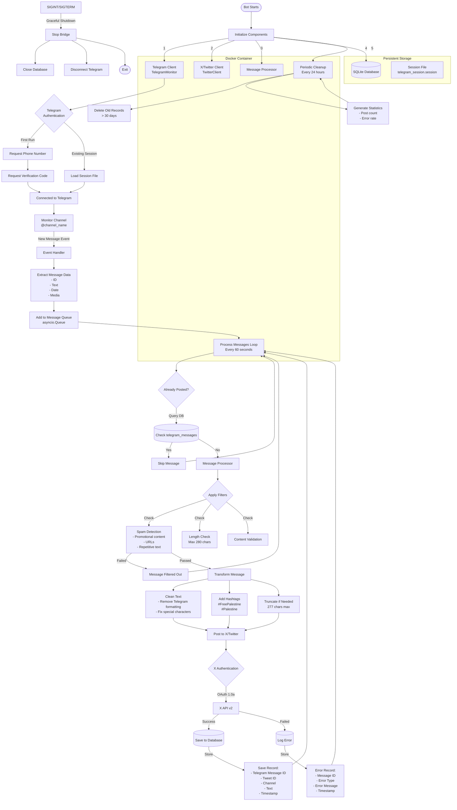

# Telegram to X (Twitter) Bridge Bot

A Telegram to X (Twitter) bridge application that automatically forwards posts from Telegram channels to Twitter/X.

## How It Works

The bot operates as a bridge between Telegram and X (Twitter), automatically monitoring Telegram channels and posting content to X. Here's a detailed flow diagram:



## Architecture Overview

The bot consists of several key components working together:

### 1. **Telegram Client** (`telegram_client.py`)
- Uses Telethon library for Telegram API interaction
- Maintains persistent session to avoid re-authentication
- Monitors specified channel for new messages
- Extracts message content and metadata
- Pushes messages to async queue for processing

### 2. **Message Processor** (`message_processor.py`)
- Filters out spam and promotional content
- Cleans Telegram-specific formatting
- Adds relevant hashtags (#FreePalestine #Palestine)
- Ensures text fits X's character limit (280 chars)
- Validates content before posting

### 3. **X/Twitter Client** (`twitter_client.py`)
- Handles OAuth 1.0a authentication
- Posts processed messages to X
- Manages rate limiting
- Returns tweet IDs for tracking

### 4. **Database Layer** (`database_sqlite.py`)
- SQLite for lightweight, reliable storage
- Tracks posted messages to prevent duplicates
- Logs errors for debugging
- Maintains posting statistics
- Automatic cleanup of old records

### 5. **Main Bridge** (`main.py`)
- Orchestrates all components
- Manages async message processing loop
- Handles graceful shutdown on signals
- Runs periodic maintenance tasks

## Data Flow

1. **Message Reception**: New messages from Telegram channel trigger event handler
2. **Queue Management**: Messages added to async queue for controlled processing
3. **Duplicate Check**: Database query prevents reposting same content
4. **Content Processing**: Filter, clean, and enhance message text
5. **X Posting**: Authenticated API call to post tweet
6. **Record Keeping**: Save successful posts or log errors to database
7. **Continuous Loop**: Process repeats every 60 seconds (configurable)

## Session Management

The bot maintains two types of persistent data:
- **Telegram Session**: Stored as `telegram_session.session` at project root, preserves authentication
- **SQLite Database**: `ffp.db` at project root, tracks posting history and errors

## Error Handling

- Network failures: Automatic retry with exponential backoff
- API rate limits: Respects X's rate limiting
- Authentication errors: Logged to database for debugging
- Graceful shutdown: Properly closes connections on SIGINT/SIGTERM

## Features

- **Automatic Message Forwarding**: Monitors Telegram channels and posts to X
- **Media Support**: Handles photos and videos
- **Smart Text Processing**: Adds hashtags (#FreePalestine #Palestine)
- **Duplicate Prevention**: SQLite database tracking to avoid reposting
- **Error Handling**: Robust error logging and retry mechanisms
- **Content Filtering**: Filters out spam and irrelevant content
- **Production Ready**: Lightweight SQLite database for reliable storage
- **Docker Support**: Easy deployment with docker-compose

## Prerequisites

- Python 3.13+
- Telegram API credentials (api_id and api_hash)
- X/Twitter API credentials (API keys and tokens)

## Installation

### Using Docker Compose

1. Clone the repository:

```bash
git clone https://github.com/yourusername/ffp.git
cd ffp
```

2. Copy the environment file:

```bash
cp .env.example .env
```

3. Edit `.env` with your credentials:

   - Get Telegram API credentials from https://my.telegram.org
   - Get X API credentials from https://developer.twitter.com

4. Start the application:

```bash
docker-compose up -d
```

### Local Installation

1. Clone the repository:

```bash
git clone https://github.com/yourusername/ffp.git
cd ffp
```

2. Run the setup (installs UV if needed and sets up the project):

```bash
make setup
```

3. Activate the virtual environment:

```bash
source .venv/bin/activate  # On Windows: .venv\Scripts\activate
```

4. Set up configuration:

```bash
cp .env.example .env
```

5. Edit `.env` with your credentials:
   - Get Telegram API credentials from https://my.telegram.org
   - Get X API credentials from https://developer.twitter.com

## Configuration

Edit the `.env` file with your settings:

```env
# Telegram Configuration
TELEGRAM_API_ID=your_api_id
TELEGRAM_API_HASH=your_api_hash
TELEGRAM_PHONE=+1234567890
TELEGRAM_CHANNEL_USERNAME=@channel_name

# X (Twitter) Configuration
X_API_KEY=your_api_key
X_API_SECRET=your_api_secret
X_ACCESS_TOKEN=your_access_token
X_ACCESS_TOKEN_SECRET=your_access_token_secret
X_BEARER_TOKEN=your_bearer_token

# Application Settings
POST_INTERVAL_SECONDS=60
LOG_LEVEL=INFO
```

## Usage

### Quick Start with Docker

```bash
# Start all services (PostgreSQL + App)
docker-compose up -d

# View logs
docker-compose logs -f app

# Stop services
docker-compose down
```

### Local Development

```bash
# Install dependencies
uv sync

# Run the application
uv run python main.py

# Or using Make:
make install  # Install dependencies
make run      # Run the application
make dev      # Install with dev dependencies
make lint     # Run linting
make format   # Format code
```

On first run, you'll need to authenticate with Telegram using your phone number.

## Features in Detail

### Message Processing

- Automatically adds #FreePalestine and #Palestine hashtags
- Cleans Telegram formatting for Twitter compatibility
- Handles long messages with truncation
- Filters spam and promotional content

### Media Handling

- Downloads photos and videos from Telegram
- Uploads media to X with appropriate formatting
- Cleans up temporary files after posting

### Database

- PostgreSQL with connection pooling for high performance
- Tracks posted messages to prevent duplicates
- Indexes for fast lookups
- Logs errors for debugging
- Periodic cleanup of old records
- Statistics view for monitoring posting activity

## Troubleshooting

1. **Authentication Issues**:

   - Ensure your API credentials are correct
   - Check that your X app has read/write permissions

2. **Rate Limits**:

   - The app respects X API rate limits automatically
   - Adjust POST_INTERVAL_SECONDS if needed

3. **Media Upload Failures**:
   - Check file size limits (512MB for videos)
   - Ensure sufficient disk space for downloads